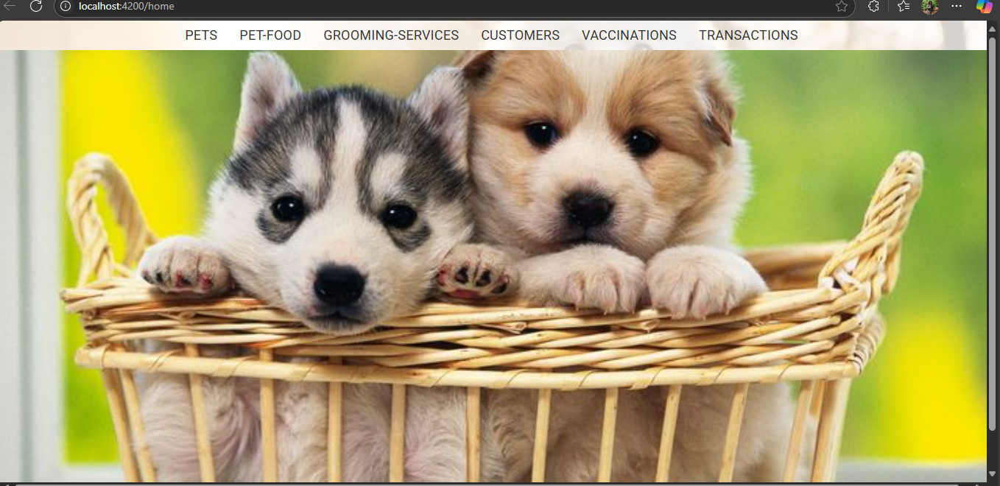
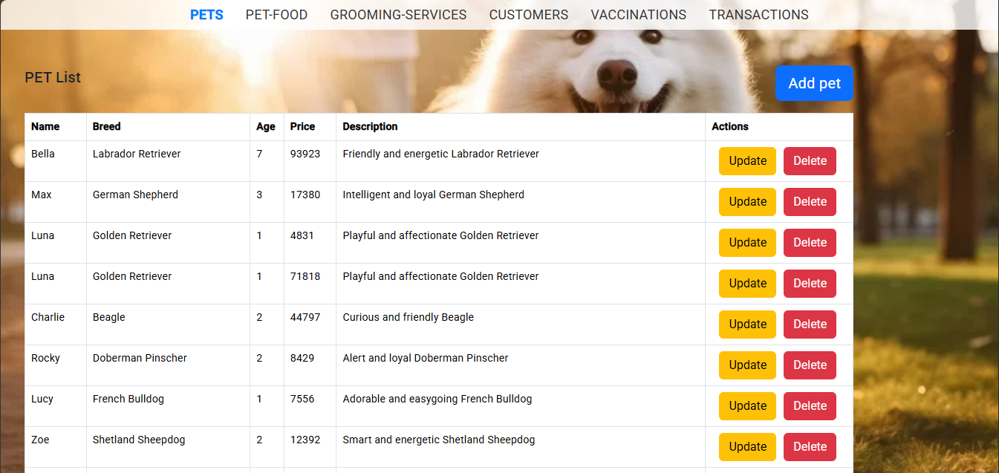
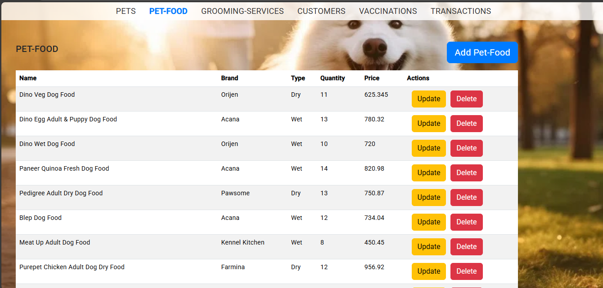
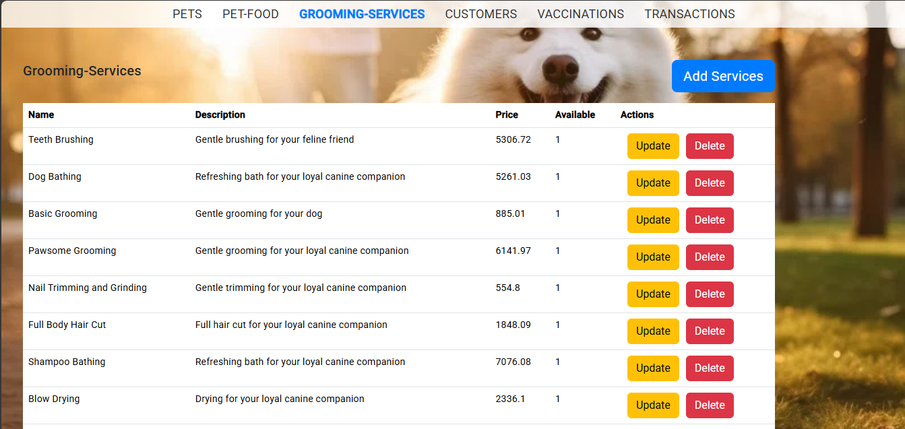
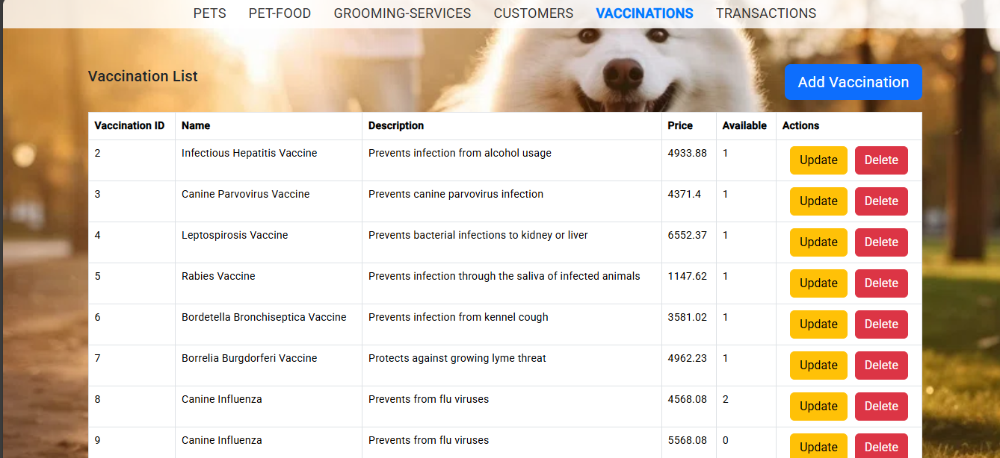
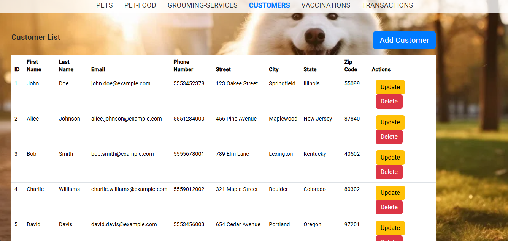
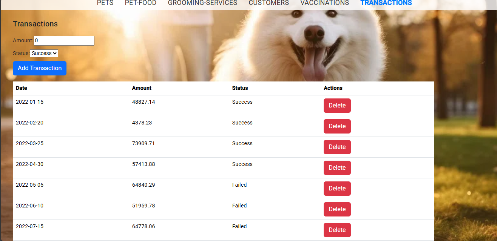

# 🐾 Pet Shop Management System

A full-stack web application to streamline pet shop operations — including pet registrations, grooming services, vaccinations, customer profiles, transactions, and inventory management.

---

## 🚀 Tech Stack

- **Backend:** Java, Spring Boot  
- **Frontend:** Angular, HTML, CSS  
- **Database:** MySQL  
- **IDE:** Eclipse, VS Code, Spring Tool Suite

---

## 📌 Features

- 🐶 Add, edit, and delete pet details  
- 💈 Manage grooming and vaccination services  
- 👤 Customer profile management  
- 💰 Transaction and payment tracking  
- 📦 Inventory and service availability management  
- 📊 Centralized dashboard for operational insights

---
## 📸 Screenshots

### 🏠 Homepage / Dashboard


### 🐶 Pets List


### 🍖 Pet Food List


### 💈 Grooming Services


### 💉 Vaccinations


### 👤 Customers List


### 💰 Transactions


---

## 🛠️ Setup Instructions

### 1. Clone the repository

```bash
git clone https://github.com/Roshini-balla/PetShopFullStack.git
